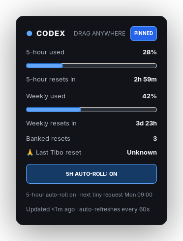
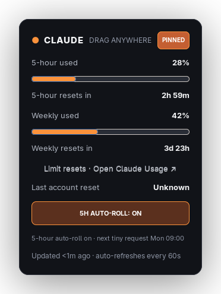
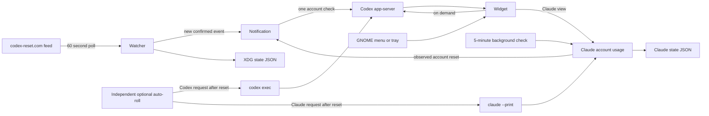

# Codex & Claude Reset Widget

A tiny resident Linux utility for monitoring Codex and Claude subscription usage and resets. It lives in the GNOME status tray and opens as a compact card. When Claude Code is installed, click the provider name to switch between the blue **CODEX** view and the orange **CLAUDE** view.

<table>
  <tr>
    <td align="center"><strong>Codex</strong></td>
    <td align="center"><strong>Claude</strong></td>
  </tr>
  <tr>
    <td></td>
    <td></td>
  </tr>
</table>

Screenshots use example usage values. The installed app and launcher remain named **Codex Widget**.

## Features

- Detects installed Claude Code automatically and remembers your selected provider.
- Refreshes real account usage every 60 seconds while the widget is visible, with separate five-hour and weekly reset countdowns.
- Offers independent, opt-in five-hour auto-roll schedules for Codex and Claude, with persistent deadlines, retries and verification.
- Shows Codex banked resets and Tibo's latest global reset. Polls the verified feed once per minute, falls back when necessary, deduplicates events and preserves newer saved resets.
- Correlates an active Tibo reset signal with a fresh low-usage Codex observation when the tracker has not confirmed it yet.
- Reads Claude's own account usage, observes account resets, and links to Claude's Usage page for available limit-reset offers.
- Uses npm-installed Codex's bundled native executable on Linux so a broken Node launcher does not interrupt usage reads or auto-roll.
- Lives in the GNOME AppIndicator tray with Open, Check Now, and Quit actions.
- Drag from the card's content; provider, pin, auto-roll and reset-offer controls remain clickable. Pinned mode keeps the widget above other windows.
- Unpinned widgets hide on focus loss; Escape always dismisses and unpins.
- Starts automatically through a systemd user service.
- Stores only minimal local state under the XDG state directory.

## Notifications

Codex uses two-stage notifications: a global reset announcement followed by an account check.

<table>
  <tr>
    <td align="center"><strong>Codex reset announced</strong></td>
    <td align="center"><strong>Codex account checked</strong></td>
  </tr>
  <tr>
    <td></td>
    <td></td>
  </tr>
</table>

Claude reset notifications come from observed drops in your own account's usage,
not an external announcement feed. The Claude view shows **Last account reset**
instead of Tibo's Codex reset. A first usage sample only seeds the observation;
notifications require a recent earlier sample with higher usage.

The indicator remains available in the desktop status area:

<p align="center">
  
</p>

## Requirements

- Linux with Python 3.11 or newer
- GTK 3 and PyGObject
- Ayatana AppIndicator, or GTK StatusIcon as a fallback
- A GNOME AppIndicator/KStatusNotifierItem extension for tray support
- `notify-send` from libnotify
- An installed and authenticated `codex` CLI with app-server support
- Optional: installed Claude Code with a Claude subscription login (`claude auth login`) to enable the Claude view

On Arch-based distributions, the relevant system packages include `python`, `python-gobject`, `gtk3`, `libayatana-appindicator`, and `libnotify`.

## Install

```bash
git clone https://github.com/1RV1NG-Y/codex-reset-widget.git
cd codex-reset-widget
./install-user.sh
```

The installer creates an isolated application environment under `~/.local/share/codex-widget`, installs the GNOME launcher and tray icon, and enables the background user service. The installed application does not depend on the cloned repository afterward.

To update an existing installation:

```bash
git pull --ff-only
./install-user.sh
```

The installer restarts the background service with the updated code. Then reopen **Codex Widget** from the tray or application menu.

After installation, search for **Codex Widget** in the GNOME application menu or run:

```bash
codex-widget
```

## Usage

```bash
codex-widget               # open the usage widget
codex-widget --demo-reset  # preview the two-stage reset notification
codex-widget --daemon      # run silently in the background
codex-widget --quit        # stop the resident application
```

The tray menu also provides **Open Codex Widget**, **Check usage and resets now**, and **Quit Codex Widget**.

Click **CODEX** to switch to **CLAUDE**, then click **CLAUDE** to switch back. Without Claude Code installed, the header stays in Codex mode. Each provider keeps its own usage state and auto-roll preference; switching views leaves enabled schedules running.

### Optional five-hour auto-roll

Use **ENABLE 5H AUTO-ROLL** in the widget to keep a five-hour window active
continuously. The opt-in is persisted across restarts. When enabled, the resident
process reads the current limits and schedules one ephemeral, read-only
`gpt-5.6-luna` request in Codex, or one tiny Haiku request in Claude, ten seconds after the active five-hour window resets.
If no five-hour window is active, it attempts activation immediately.

Command completion alone is not success. After each request the worker reads
limits three times over 30 seconds. Only a future reset timestamp whose range
stays within three seconds is marked verified; a sliding or missing timestamp
is reported as activation unconfirmed. Rounded 0% usage is allowed when the
timestamp is stable. This confirms an active countdown, not exclusive attribution
to the widget if other clients are using the account.

Each request consumes quota. Failed attempts retry after one minute; every third
failure triggers a five-hour cooldown. Deadlines, verification and failure counts
persist across restarts. Idle “now + five hours” readings cannot postpone a
committed request or bypass retry backoff. The widget shows the next action and
last verified window, never treating an old command-only success as verified.
Disabling the toggle cancels the pending activation.

### Claude support

Install Claude Code and sign in with `claude auth login`. The widget detects
`claude` on PATH or in `~/.local/bin`; installation alone enables the header switch,
and missing or expired subscription authentication produces a sign-in message in
the Claude view. `CLAUDE_CONFIG_DIR` is supported. The widget reads Claude's own
OAuth usage endpoint for five-hour and weekly percentages and reset timestamps.
It reuses and, when possible, renews Claude Code's saved login; tokens are never
copied into widget state. Renewal sends the saved OAuth scopes and a widget user
agent, and saves both rotated tokens and their expiry times together. The widget
checks usage before renewing, so a stale local expiry timestamp does not interrupt
a working token. It picks up login changes made by Claude Code without restarting.
Temporary renewal or access failures report their HTTP status and retry. A rejected
refresh token or repeated unauthorized usage asks you to sign in again.
The usage endpoint is an internal Claude interface and
may change independently of this widget.

The same auto-roll toggle works in Claude with its own persisted opt-in, retry
backoff, verification history and deadline. It starts disabled and does not inherit
Codex's setting. When enabled, it sends one tiny Haiku request with tools, MCP
servers, user/project settings and session persistence disabled. Three fresh
usage reads over 30 seconds must verify a stable future five-hour reset before
success is recorded. A full weekly quota pauses activation until the weekly
reset. Both providers' enabled schedules continue when switching views.

Claude provides occasional account-specific limit-reset offers, redeemable in
its web or desktop Usage page. Its OAuth usage and profile responses do not
expose an offer count, so **Limit resets · Open Claude Usage** opens that native
account page rather than guessing a banked-reset number. See
[Claude's limit-reset documentation](https://support.claude.com/en/articles/17007452-what-is-a-limit-reset).
The widget never redeems a reset automatically.

While visible, either view refreshes once a minute. Claude also checks usage
every five minutes in the background to observe account resets. HTTP rate limits
pause further Claude usage requests for five minutes, including forced reads.
Claude state is kept separately in `claude-state.json` beside Codex's `state.json`.

## Startup and local state

The enabled user service starts with your graphical session and owns the widget's
single application instance. Opening the launcher starts that service if needed
and waits for its application connection before asking it to show the window.
Repeated launches reuse that same process, including immediately after a service
restart. If automatic startup is disabled, or systemd is unavailable, the launcher
runs the widget directly.

The window requests focus when opened, allows the launcher focus transition to
settle, and cancels pending dismissal timers when reopened. Account refreshes only
update the visible card. An unpinned widget still dismisses when it loses focus;
pinning keeps it visible, and Escape closes it.

Manage automatic startup with:

```bash
systemctl --user status codex-widget.service
systemctl --user restart codex-widget.service
systemctl --user disable --now codex-widget.service
```

State lives under `${XDG_STATE_HOME:-~/.local/state}/codex-widget/`:

- `state.json`: Codex usage, reset history, auto-roll state and the selected view.
- `claude-state.json`: Claude usage, observed resets and its independent auto-roll state.

## How it works



Account usage and global announcements come from separate sources:

- `https://codex-reset.com/api/feed` answers whether a reset was publicly announced.
- `account/rateLimits/read` on the local Codex app-server answers what the current account actually reports.
- Claude's `https://api.anthropic.com/api/oauth/usage` returns its account's usage windows; Claude has no Tibo tracker dependency.

For npm-installed Codex on Linux, the widget uses the native executable bundled
with that same installation. This lets usage queries and five-hour auto-roll
continue working if a system update breaks the Node launcher. Other Codex
installations use their normal executable. App-server startup errors include the
underlying error in the widget's status text.

## Resource usage

The resident GTK/Python process stays in the tray; Codex CLI subprocesses run only for account checks and optional activations. Network activity includes one primary Codex reset-feed request per minute, plus a fallback request when needed. Codex account queries run when its view opens, once per minute while visible, and after a new reset event. Claude checks its account once per minute while its view is visible and every five minutes in the background when installed. Only the selected view refreshes on the visible-widget timer. Enabling auto-roll adds account checks and one tiny activation request per provider's five-hour window, plus bounded retries and verification reads.

## Development

Run the source tree without installing:

```bash
PYTHONPATH=src python3 -m codex_widget.cli
```

Run the test suite:

```bash
PYTHONPATH=src python3 -m unittest discover -s tests -v
```

The tests cover usage parsing, authentication and rate-limit handling, provider switching, state separation, reset observations, auto-roll verification and window interactions. Tests use mocked account requests and do not consume provider quota.

See [CHANGELOG.md](CHANGELOG.md) for release changes.

## License

MIT
